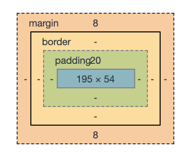

# CSS Box Model

## CSS Box Model이란?

모든 HTML 요소는 사각형 형태의 Box 영역을 가지고 있다. (크롬 개발자도구에서 볼 수 있는 바로 그것!)

CSS Box Model이란, 모든 HTML 요소를 감싸고 있는 이 **박스**를 말한다.



## CSS Box Model의 구성요소

CSS Box Model은 아래 4가지로 구성되어있다.

1. **Content**: 요소의 실제 내용이 위치하는 영역이다. **width, height** 프로퍼티를 갖는다.
2. **Padding**: Border 안쪽에 위치하는 요소의 내부 여백 영역이다. 요소에 적용된 배경색/이미지는 이 Padding까지 적용된다.
3. **Border**: 테두리 영역이다.
4. **Margin**: Border 바깥에 위치하는 요소의 외부 여백 영역이다.

## Box-sizing

Box-sizing 속성은 요소의 **width, height이 계산되는 방식을 결정**하며, content-box와 border-box 2가지 값이 있다.

- content-box (기본값) - width, height를 설정했을때 그 값이 **content box**의 width, height가 된다. 요소의 최종 렌더된 박스 사이즈는 설정된 border, padding 값이 width, height에 더해진 값이 된다.
- border-box - width, height를 설정했을때 그 값이 **최종 렌더된 박스 사이즈**의 width, height가 된다. width, height에 맞추기 위해 설정된 border, padding 값만큼 content-box의 크기가 줄어들게 된다. (단, 설정한 width, height보다 실제 콘텐츠가 크면 콘텐츠 영역을 넘치게 된다.)

### 예시로 알아BOZA


>  그림 출처: https://poiemaweb.com/css3-box-model

똑같이 width를 200px로 설정했을 때,

- `box-sizing:content-box` 는 순수 content의 너비만 200px이고, 여기에 padding+border+margin이 더해진 값이 최종 box size의 너비가 된다.
- `box-sizing:border-box` 는 content+padding+border+margin이 더해진 값이 최종 box size의 너비가 된다.

예제에서 느껴지듯, 우리가 보통 특정 요소의 너비/높이를 생각할 때는 테두리까지 포함한 크기를 생각한다.

이에 일반적으로 `box-sizing:border-box` 가 더 자주 쓰인다. 우리가 직관적으로 계산하는 요소 크기와 일치하기 때문에.

## border-box로 초기화하기

앞서 말했듯 box-sizing의 초기값은 content-box다. 직관적인 사이즈 계산을 위해 초기값을 border-box로 초기화하기 위해서는 어떻게 해야 할까?

box-sizing 프로퍼티는 상속되지 않으므로, 모든 요소가 `box-sizing:border-box` 프로퍼티를 사용하도록 초기화하려면 아래와 같이 정의해주면 된다.

```css
html {
  box-sizing: border-box;
}
*, *:before, *:after {
  box-sizing: inherit;
}
```

## References

https://developer.mozilla.org/en-US/docs/Web/CSS/box-sizing

https://poiemaweb.com/css3-box-model