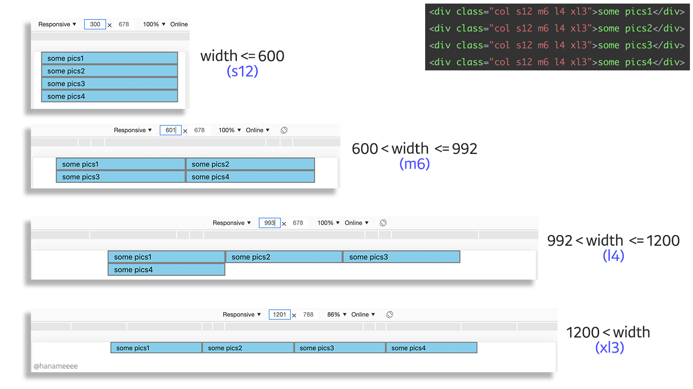

# Materialize

[공식 문서](https://materializecss.com/)


## 1) Grid System - [link](https://materializecss.com/grid.html)

###1-1. Grid System 을 구성하는 요소들

- Container
- Columns
- Row


`Container` : 필수 요소는 아니나, 레이아웃에서 페이지의 컨텐츠를 가운데 정렬하기 위해 권장됨.

용례는 아래와 같다.

```html
<body>
  <div class="container">
    <!-- 컨테이너가 들어가는 부분 -->
  </div>
</body>
```

소스코드는 아래와 같다.

```css
.container {
  margin: 0 auto;
  max-width: 1280px;
  width: 90%;
}

@media only screen and (min-width: 601px) {
  .container {
    width: 85%;
  }
}

@media only screen and (min-width: 993px) {
  .container {
    width: 70%;
  }
}
```

993px 이상의 **large screen에서는 70%** (단 max-width 1280px), 601~992px 사이의 **middle screen에서는 85%**, 600px 이하의 **small screen에서는 90%** 의 width를 차지하는 것을 알 수 있다.

나아가, margin은 0 auto로 기본값이 가운데 정렬.


`Columns` : Grid System의 필수 요소로, 브라우저의 크기와 상관없이 일정한 width를 유지하기에 일관성 있는 레이아웃 제작에 편리하다.

용례는 아래와 같다.

```html
<div class="row">
  <!-- column은 *반드시* row로 감싸져있어야 한다 -->
  <div class="col s12">1</div>
  <div class="col s6">6-columns (one-half)</div>
  <div class="col s6">6-columns (one-half)</div>
</div>
```

소스코드는 아래와 같다.

```css
.row .col.s1 {
  /* 12분의 1만큼 가로 %를 차지 */
  width: 8.3333333333%;
  margin-left: auto;
  left: auto;
  right: auto;
}

.row .col.s2 {
  /* 12분의 2만큼 가로 %를 차지 */
  width: 16.6666666667%;
  margin-left: auto;
  left: auto;
  right: auto;
}

.row .col.s3 {
  /* 12분의 3만큼 가로 %를 차지 */
  width: 25%;
  margin-left: auto;
  left: auto;
  right: auto;
}

.row .col.s4 {
  /* 12분의 4만큼 가로 %를 차지 */
  width: 33.3333333333%;
  margin-left: auto;
  left: auto;
  right: auto;
}

/* 중략 */

.row .col.s12 {
  /* 12분의 12만큼 가로 %를 차지 */
  width: 100%;
  margin-left: auto;
  left: auto;
  right: auto;
}
```


col 에는 `.s1 ~ s12` , `.m1 ~ m12` , `.l1 ~ l12` `.xl1 ~ xl12` 까지 각각 4가지 (s,m,l,xl) class 구분이 존재한다.

이들의 차이점은 viewport의 width 차이!

아래 소스코드를 참고하자.

```css
.row .col.s1 {
  width: 8.3333333333%;
  margin-left: auto;
  left: auto;
  right: auto;
}
/* 이후 생략 */

@media only screen and (min-width: 601px) {
  .row .col.m1 {
    width: 8.3333333333%;
    margin-left: auto;
    left: auto;
    right: auto;
  }
  /* 이후 생략 */
}

@media only screen and (min-width: 993px) {
  .row .col.l1 {
    width: 8.3333333333%;
    margin-left: auto;
    left: auto;
    right: auto;
  }
  /* 이후 생략 */
}

@media only screen and (min-width: 1201px) {
  .row .col.xl1 {
    width: 8.3333333333%;
    margin-left: auto;
    left: auto;
    right: auto;
  }
  /* 이후 생략 */
}

```

이처럼 grid system에서 기본적으로 **[ 600 | 992 | 1200 ] 3개의 breakpoint** 을 제공하기에,  **[ small (ex.phone) | medium (ex.tablet) | large (ex.laptop) | extra large(ex.desktop)] 의 4가지 screen size**에 대해 반응형으로 레이아웃을 짤 수 있다.

예를 들면 아래와 같이 코드를 작성할 경우

```css
<div class="row">
  <div class="col s12 m6 l4 xl3">some pics1</div>
  <div class="col s12 m6 l4 xl3">some pics2</div>
  <div class="col s12 m6 l4 xl3">some pics3</div>
  <div class="col s12 m6 l4 xl3">some pics4</div>
</div>
```
아래처럼 width에 따라 다른 가로 길이를 가지게 된다.




`row` : column은 항상 row로 감싸져 있어야 한다.

용례는 아래와 같다.

```html
<div class="row">
  <div class="col s12">이 div는 12칸을 다 먹습니다 옴뇸뇸</div>
  <div class="col s2">6-columns (one-half)</div>
  <div class="col s2">6-columns (one-half)</div>
</div>
<div class="row">
  <div class="col s2">합이</div>
  <div class="col s3">12가 안되도</div>
  <div class="col s4">6-columns (one-half)</div>
</div>
```

소스코드는 아래와 같다.

```css
.row {
  margin-left: auto;
  margin-right: auto;
  margin-bottom: 20px;
}
```

margin-bottom 덕분에 row 와 row 사이에는 기본값으로 20px의 아래 간격이 존재한다.


**🧐QUESTION🧐** - 왜 row 와 col 에 minus margin이 들어가 있지? 아래 친구들의 존재이유는 뭐지?

```css
.row:after {
  content: "";
  display: table;
  clear: both;
}

.row .col {
  float: left;
  -webkit-box-sizing: border-box;
          box-sizing: border-box;
  padding: 0 0.75rem;
  min-height: 1px;
}

.col .row {
  margin-left: -0.75rem;
  margin-right: -0.75rem;
}
```

[참고 링크](https://stackoverflow.com/questions/47530351/why-negative-margin-in-row) - 중첩 시 밀리는 문제 때문인 것 같은데...? gutter 과 연결해서 공부하기


### 1-2. Columns 를 조정하는 기능들

- Offsets
- Push
- Pull

