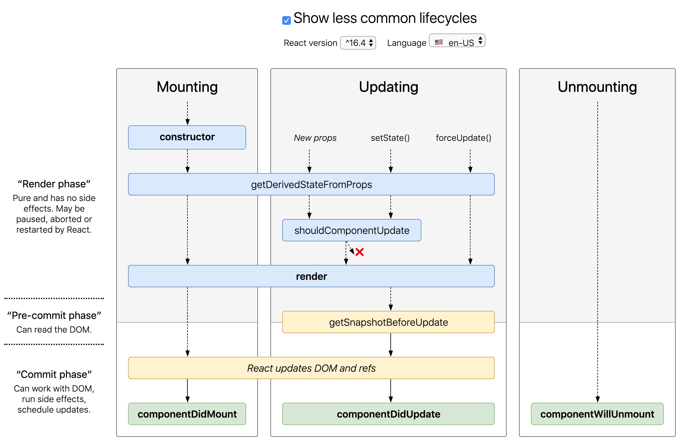

# I Don't Know React 🤬

##### [부제 - 어설프게 리액트 쓰다 복장 터진 사람이 복장 되찾으려 쓰는 정리 문서]

---


## React, 왜 쓰냐

### 1. React의 동작 원리


## React, 어떻게 쓰냐


## React, 어떻게 잘 쓰냐

### 0. 성능 최적화 방법


---

## [React Components, Elements, and Instances](https://medium.com/@dan_abramov/react-components-elements-and-instances-90800811f8ca)

- Component : a class with a *render()* method, or a function. In both cases, it takes props as input, returns element tree as output

- Instances : Component의 instance (class component에서 this에 해당하는 것 - 우리는 직접 instance를 만들 필요가 없다. React가 대신 해줌)

- Element : Plain **object** describing a component instance or DOM nod and its desired properties - Element는 instance가 아니고, React에게 screen 에서 보고 싶은 것을 알려주기 위한 방법. 실제 DOM element 보다 훨씬 가벼우며 parsed 될 필요 없이 traverse 하면 된다.

  ```js
  {
    type: 'button',
    props: {
      className: 'button button-blue',
      children: {
        type: 'b',
        children: 'OK!'
      }
    }
  }
  ```

  ```html
  /* 위의 React element는 이 HTML을 나타냄*/
  <button class='button button-blue'>
    <b>
      OK!
    </b>
  </button>
  ```

  

Component가 input으로 어떤 prop을 받았다면, 그건 부모 Component가 해당 element를 type, prop과 함께 return 했기 때문이다. Props flows one way in React: from parents to children.

## [React 렌더링과 성능 알아보기](https://meetup.toast.com/posts/110)

### Render

React는 UI의 구조를 내부적으로 컴포넌트가 반환하는 엘리먼트(Plain Object)들의 트리 형태로 관리하고 표현한다.

컴포넌트의 props나 state의 변경이 있을 때, React는 컴포넌트의 이전 상태 엘리먼트와, 새로 만들어진 엘리먼트를 비교하고 실제 DOM의 업데이트 여부를 결정한다. (비교하여 얻은 변경점에 대해서만 갱신)

엘리먼트는 Immutable이기 때문에 속성들(Props)을 직접 수정할 수 없다. 각 렌더링에 항상 새로운 엘리먼트를 만든다.

컴포넌트의 setState() 메서드가 수행되면 해당 컴포넌트를 Dirty Component로 등록하고, 다음 event loop에서 해당 컴포넌트들의 엘리먼트를 렌더링한다.

React의 렌더링은 변경점을 찾는 과정 + 변경점을 실제 UI에 적용하는 작업 2가지로 나눌 수 있다.

### Reconciliation - 변경점을 찾는 과정

React의 reconciliation이란 어떤 변경에 대한 전/후 엘리먼트 트리를 비교하여 갱신이 필요한 부분만 업데이트 하는 것을 의미한다. 이를 통해 브라우저에서 DOM에 대한 제어를 최소화할 수 있다.

> 정리하자면, React 컴포넌트는
> (1) render() 에서 새로운 element tree를 생성하고
> (2) 이전 element tree와 비교해 변경점을 찾아 갱신한다

### Avoiding Reconciliation - 불필요한 렌더링 방지



### Bad Cases - 실수하기 쉬운 경우

#### 1. 분리되지 않은 컴포넌트

컴포넌트를 제대로 분리하지 않으면 가독성, 유지보수 뿐만 아니라 성능에 손해가 있어도 쉽게 알아챌 수 없다.


두 앱에서 똑같이 title을 변경할 때, 성능에 큰 차이가 있다.

#### 2. 잘못된 Props 전달

```js
// App 컴포넌트의 render 메소드
render() {
  return (
    <div className="app">
      ...
      <div className="app-intro">
        {this.state.title}
      </div>
      <List items={this.state.items} deleteItem={id => this.deleteItem(id)}/>
    </div>
  );
}
```

```js
// List 컴포넌트의 render 메소드
render() {
    const items = this.props.items.map((item) => {
      return <Item key={item.id} {...item} onClickDeleteButton={this.props.deleteItem} />
    });

    return (
      <ul>
        {items}
      </ul>
    );
  }
}
```

`deleteItem={id => this.deleteItem(id)}` 구문으로 인해, App의 render() 에서 List로 넘어가는 deleteItem 이 항상 새로운 함수로 생성된다.

따라서 List가 Reconcilation 작업에 포함되게 되어 성능이 저하된다.

그래서 보통 props로 넘어가는 함수는 생성자에서 미리 바인딩하고 `deleteItem={this.deleteItem}` 구문처럼 새로운 함수 없이 전달하는 것이 좋다.


컴포넌트를 적절히 분리하는 것은 중요하다!
기능, 책임, 재사용성 등으로 컴포넌트를 적절히 분리하여 이슈를 빠르게 파악하고 대응할 수 있도록 개발해야 한다.

