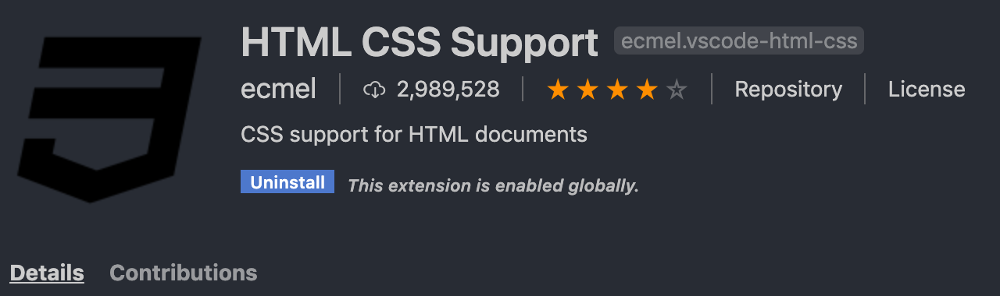

# Tailwind CSS란?

[참고 자료 - Youtube Tailwind CSS Crash Course](https://www.youtube.com/watch?v=UBOj6rqRUME)
[참고 자료 2 - Tailwind CSS: Is it tomorrow’s Bootstrap? ](https://blog.logrocket.com/tailwind-css-is-it-tomorrows-bootstrap-ebe560f9d00b/)

[Tailwind CSS 공식 문서](https://tailwindcss.com/docs/installation/)

Utility-first **CSS Framework**. Tailwind is a collection of low-level utility classes. They can be used like lego bricks to build any kind of component.

Bootstrap, materialize와 같은 CSS Framework이다.
근데 걔네랑 뭐가 다르냐?

Bootstrap, materialize는 **predefined components 기반**이다. Ex. Progress Bars, NavBar 등등...

반면 Tailwind는 predefined component 가 없다. 그냥 **set of utility classes** 에 불과하다. utility 들을 가지고 component를 만들 수 있게! Component가 아니라 utility를 제공하므로 훨씬 low-level이다.

## 실습

### install

node 프로젝트 시작 (package.json 파일 생성)

```shell
npm init -y
```

```shell
npm install tailwindcss --save-dev
```
tailwind를 사용하기 위해선 기본적으로 src의 css 파일에 아래 3가지 tailwind 문법을 포함해야 한다.
```css
@tailwind base;

@tailwind components;

@tailwind utilities;
```

이후 build를 하면 tailwind가 이 문법을 사전에 정의된 CSS로 변환할 것이다.
참고로 css를 tailwind를 통해 처리하기 위한 build 명령어는 아래처럼 미리 스크립트화 해놓으면 편하다. `src/style.css` 는 위의 기본 tailwind 문법을 선언한 파일, -o flag 뒤의 `public/style.css` 는 tailwind가 변환한 build css 파일이 들어갈 위치. 

### Customization

```css
"scripts": {
  "test": "echo \"Error: no test specified\" && exit 1",
  "build:css": "tailwind build src/style.css -o public/style.css"
},
```

```shell
npx tailwindcss init
```

위 명령어를 통해 config file 을 추가해 기본 스타일을 변경하거나, 없는 색상을 추가하거나 등의 customization이 가능하다.

```bash
module.exports = {
    theme: {
        container: {
            center: true,
            padding: "2rem",
        },
        extend: {},
    },
    variants: {},
    plugins: [],
};
```

`style.css`

```css
@tailwind base;

@tailwind components;

@tailwind utilities;

.btn {
    @apply font-bold py-2 px-4 rounded;
}

.btn-purple {
    @apply bg-purple-500 text-white;
}

.btn-purple:hover {
    @apply bg-purple-400;
}
```

위 처럼 apply directive를 사용해 자주 사용되는 유틸리티들을 하나로 모아 custom class로 만들 수 있다.

### 참고

+) 아래 VS extension을 깔면 class 입력 시 dropdown으로 자동완성 되어서 편리하다. 잠깐 해보니 tailwind css 사용할 땐 아래 extension + emmit 조합으로 하면 어마어마하게 생산성이 좋을 것 같다.




## 생각해볼 점

- styled component와 같은 CSS-in-js와 어찌어찌 사용은 가능한 것 같지만 ([링크](https://medium.com/swlh/use-tailwindcss-with-gatsby-with-emotion-or-styled-components-7504135b9941)) 무언가 지금의 나에겐 투머치인 것 같다. 일단 Styled component의 themeprovider 등 심화 기능(?) 에 먼저 익숙해지고, React가 아닌 단순 static page를 만들 때 사용해보며 연습해보는 것이 좋겠다.
- React, Vue JS와 같은 component 단위의 프론트엔드 개발 방식이 대중화되며 이에 걸맞는 CSS framework 들이 등장하고 있다. 이와 연관된 개념인 Atomic CSS 에 대해 공부해볼 필요가 있을 것 같다. [링크](https://johnpolacek.github.io/the-case-for-atomic-css/)

